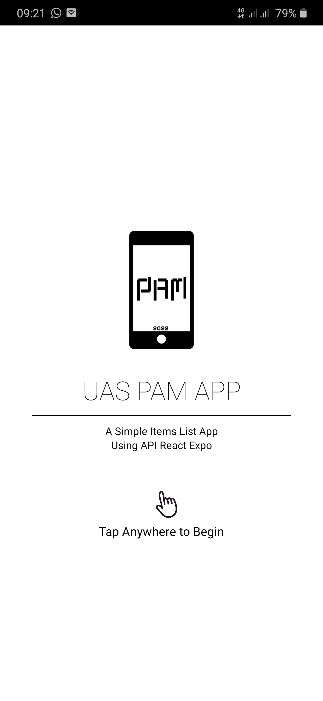
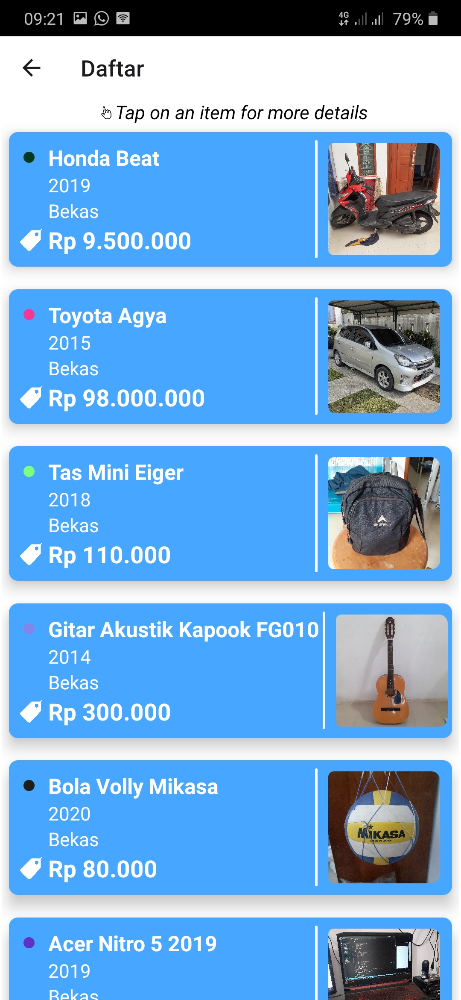
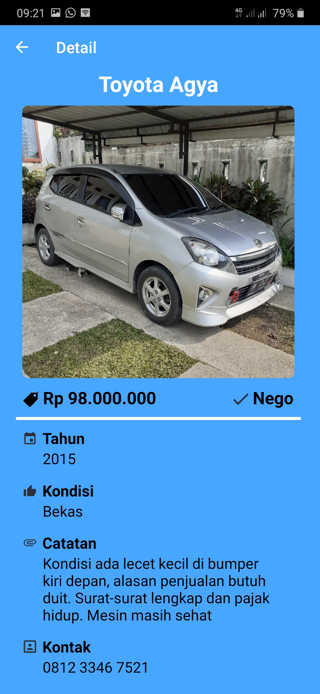

# uas_app
API React Expo Implementation on Android Mobile

# Identitas Mahasiswa
Samuel Jovial Pardede - 119140104
Kelas PAM RA

# Instalasi Aplikasi
1. Mengunduh aplikasi melaui [link berikut] (https://github.com/samueljovial21/uas_app/raw/master/APK_Installer/uas_pam.apk)
2. Sesudah aplikasi terunduh, dapat dijalankan dengan memilih pilihan "install" pada android.

# Detail Aplikasi 
# Tampilan Awal

# Tampilan Daftar Barang

# Tampilan Detail Barang

